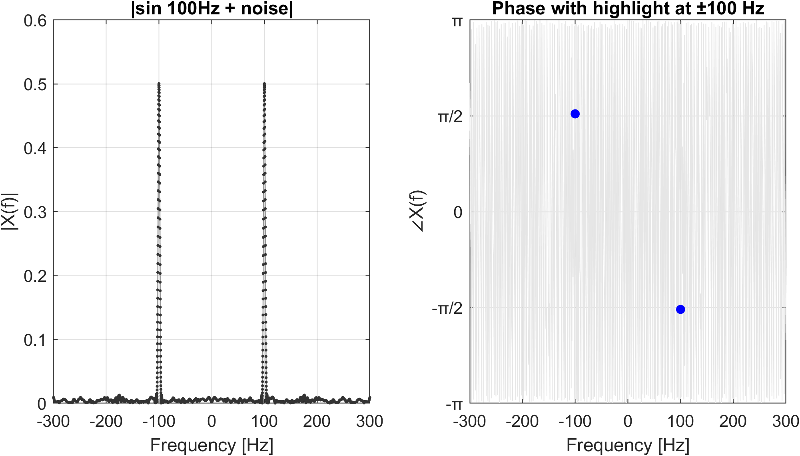
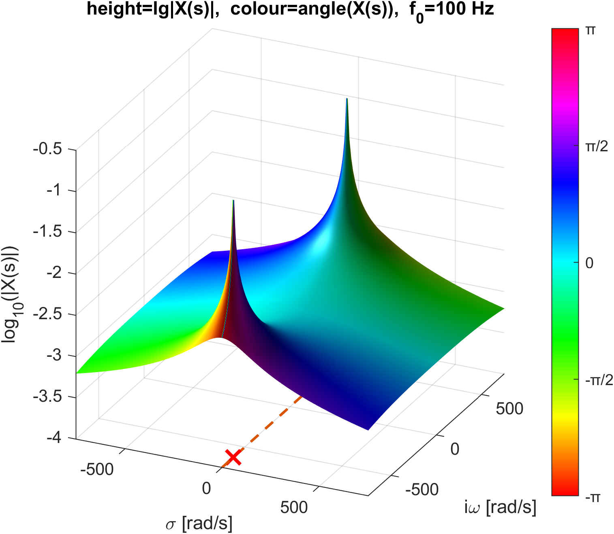
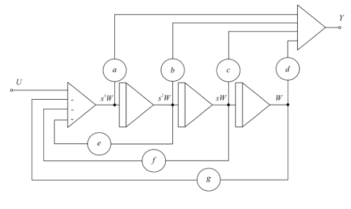
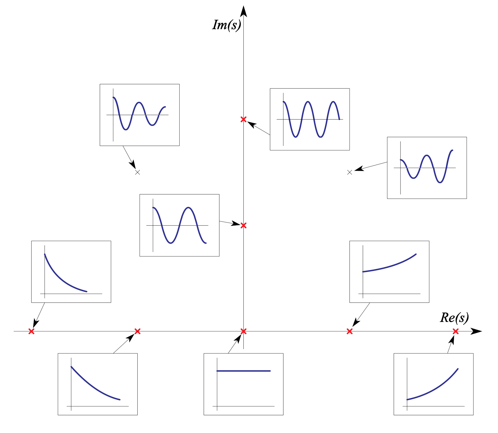
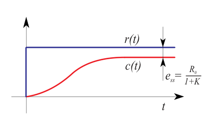

# Introduction

Control system is mechanism that alters the future state of a system. Control theory is a strategy to select the approriate inputs.

You could just try out all the values, but that's not a particulary efficient method.

Control theory is converting unstable open loop systems to stable closed loop systems, which are really just open loop systems again :). Common definition of control theory includes expected/target value of the output, but that's not really the case - control theory is modifying the behaviour of the system so that expected value is achievable under given constraints.

Inputs to the process of designing a control system are:

- objective
- criteria (goals)
- information about the system
- current state of the system
- constraints

# Systems and signals

Processes:

- continuous
- discrete
- batch

Energy of signal:

$$ E = \int_{t_1}^{t_2} |x(t)|^2\, dt $$

(Average) power of signal:

$$ P = \frac{1}{t_2 - t_1} \int_{t_1}^{t_2} |x(t)|^2\, dt $$

Shannon:

$$ f > 2f_m $$

Signals:

- constant
- linearly increasing
- step $1(t) = u(t)$
- exponential
- sinusoidal
- exponentially damped sinusoidal
- square impulse
- Dirac delta $\int_{-\infty}^{\infty} \delta(t)\, dt = 1$
- impulse train

# Modeling

All models are wrong, but some are useful; most commonly for prediction, control, optimization and training.

Best model should cover only the essential aspects of the system, depending on the objective of the modelling.

Models usually start from LTI (linear time invariant) descriptions and then are extended to include nonlinearities, time variance, stochasticity, etc. And event then we try to get back to LTI usually by linearization around the operating point (small signal response).

Conditions for LTI are:

- superposition
  - additivity $T(x_1 + x_2) = T(x_1) + T(x_2)$
  - homogeneity $T(ax) = aT(x)$
- time invariance

For almost all practical signals, when you consider a small enough time window, the system can be approximated as LTI. Example of exception: stiction.

Models can be lumpled or distributed, depending on whether the system has spatially distributed parameters (e.g. temperature distribution in a rod) or not (e.g. mass-spring-damper system).

Modeling can be theoretical (from first principles), empirical (system identification from experimental data) or a combination of the two (build model from first principles and assign parameters from data).

It really helps if you actually understand the physics of the system, because with enough parameters you can fit any data, but that doesn't make it useful in any way.

> All models are wrong, but some are useful. - George E. P. Box

.. see [AS notes](AS.md).. see book pp. 86 (Primer 3.1 Modeliranje avtomobilskega vzmetenja)

## Laplace transform

LTI systems can be described by linear differential equations, which can be solved either painfully or with Laplace transform.

$$ \mathcal{L}\{f(t)\} = F(s) = \int_0^{\infty} e^{-st} f(t)\, dt $$

Each time you use Laplace transform, you'll be likely handed a table. But you should keep these simple rules in mind anyway:

- linearity
- addition
- n^th^ derivative with 0 initial state: $\mathcal{L}\{f^{(n)}(t)\} = s^nF(s)$
- integral: $\mathcal{L}\{\int_0^t f(\tau)\, d\tau\} = \frac{1}{s}F(s)$ a.k.a $\mathcal{L}\{1(t)\} = \frac{1}{s}$
- final value theorem: $\lim_{t \to \infty} f(t) = \lim_{s \to 0} sF(s)$
- initial value theorem: $\lim_{t \to 0^+} f(t) = \lim_{s \to \infty} sF(s)$

Example with zero $y(0) = a$ and $\dot{y}(0) = b$ initial conditions:

$$ \ddot{y} + 3\dot{y} + 2y = 0 $$

$$ s^2Y(s) + 3sY(s) + 2Y(s) = as + b + 3a $$

Divide and parital fraction expansion:

$$ Y(s) = \frac{as + b + 3a}{s^2 + 3s + 2} = \frac{as + b + 3a}{(s+1)(s+2)} $$

$$ Y(s) = \frac{A}{s+1} + \frac{B}{s+2} $$

$$ A(s+2) + B(s+1) = as + b + 3a $$

Inverse laplace transform:

$$ y(t) = Ae^{-t} + Be^{-2t} $$


### Note: Laplace transform vs. Fourier transform

And don't forget the distinction between Fourier series and Fourier transform:

- Fourier Series: Used for periodic signals (patterns that repeat forever, like a perfect square wave). It decomposes the signal into a discrete sum of harmonically related frequencies (\(1f, 2f, 3f\dots\)).
- Fourier Transform: Used for aperiodic signals (one-time events, like a handclap or a transient pulse). Because the signal doesn't repeat, the frequencies blur together into a continuous spectrum rather than distinct, spaced-out notes.

| Feature | Fourier Transform | Laplace Transform  |
| :--- | :--- | :--- |
| Formula | $X(i\omega) = \int_{-\infty}^{\infty} e^{-i\omega t} x(t)\, dt$ | $X(s) = \int_0^{\infty} e^{-st} x(t)\, dt$ |
| Domain | $\omega$ (frequency) | $s = \sigma + i\omega$ (complex frequency) |
| Output | Amplitude and phase vs. $\omega$ | Amplitude and phase vs. $s$ | 
| Limits | $-\infty$ to $\infty$ | $0$ to $\infty$ |
| Kernel | $e^{-i\omega t}$ (oscillatory) | $e^{-st} = e^{-\sigma t} e^{-i\omega t}$ (exponential) |
| Sampling Space | line (The Imaginary Axis). | plane (The $s$-plane). |
| Variable | $\sigma = 0$, so variable is just $i\omega$. | $s = \sigma + i\omega$ (decay + rotation). |
| Components | Pure cosine waves | Exponential sine waves |
| Can handle (Stability) | Finite energy signals | Up to expon. growing signals |
| | (Fig.\ \ref{fig:f-vs-l-fourier}) |  |

Both transforms are bijective, meaning you can perfectly reconstruct the original signal from either transform.

And let's not forget that the Fourier transform is just a special case of the Laplace transform evaluated along the imaginary axis. 

```{=latex}
\begin{figure}[H]
\centering
\input{figures/tikz/f-vs-l-fourier.tex}
\caption{Fourier Transform of $x(t) = A\sin(2\pi \cdot 100\,\text{Hz} \cdot t)$: magnitude and phase spectrum. Light gray is undefined.}
\label{fig:f-vs-l-fourier}
\end{figure}
```





## Transfer function

Classical definition says:

$$ G(s) = \frac{Y_{out}(s)}{U_{in}(s)} $$

But we can also just say that transfer function is system response to a Dirac delta input ($\mathcal{L}\{\delta(t)\} = 1$):

$$ u_{in}(t) = \delta(t) \implies G(s) = Y_{out}(s) $$

For proportional system we can find a steady-state gain by taking the limit:

$$ K = \lim_{s \to 0} G(s) = \frac{b_m}{a_n} $$

Other than in polynomial form we can also represnet it as first factor form (showing zeros and poles:

$$ G(s) = k \frac{(s + z_1)(s + z_2)\cdots(s + z_m)}{(s + p_1)(s + p_2)\cdots(s + p_n)} $$

or second factor form (showing time constants):

$$ G(s) = K_{ss} \frac{(1 + sT_1)(1 + sT_2)\cdots(1 + sT_m)}{(1 + s\tau_1)(1 + s\tau_2)\cdots(1 + s\tau_n)} $$

PS: $k$ is not the same as $K_{ss}$ - you can still get it by taking the limit.

## Block diagrams

Block diagrams are sometimes used to represent the system. Usefull mostly for design after the causality of the system is established. (Remember ohm's law: you can rearrange it anyway you like, but block diagram can only be drawn once you decide which variable is input and which is output).

This is the distinction between causal (signal-oriented) modeling versus acausal (physical/equation-based) modeling. The latter being just a soup of equations, which a helpful tool [OpenModelica](https://www.openmodelica.org/) will rearrange for you.

# Computer analysis and simulation

God[^2] created statespace representation:

$$ \begin{bmatrix} \dot{\mathbf{x}} \\ \mathbf{y} \end{bmatrix} = \begin{bmatrix} \mathbf{A} & \mathbf{B} \\ \mathbf{C} & \mathbf{D} \end{bmatrix} \begin{bmatrix} \mathbf{x} \\ \mathbf{u} \end{bmatrix} $$

This is basicly an universal form of representation of any MIMO LTI system, which can be easily simulated on a computer.

## Indirect realization

No good for systems that have derivatives of the input. We rewrite the equation to have the highest derivative of the output on the left hand side, then we chain the integrators, sum feedbacks to get the output variable. Easy to include initial conditions.

## Canonical controllable form realization

A direct form can be obtained by considering the transfer function H(s) as a cascade of two transfer functions (one for the numerator and one for the denominator).



# System analysis in time domain

$$ y_{ss} =  \lim_{t \to \infty} y(t) = \lim_{s \to 0} sY(s) $$

We can use many different signals (see list above) to identify the system, but the most common ones are step and impulse response.

Although typically impractical, Dirac delta response directly gives us the transfer function, since $Y(s) = H(s)U(s) = H(s)$.

Then with a known model and known input signal we can predict the output signal.

## Poles and zeros



If ratio of real part of the poles is larger than 4 and there are no nearby zeros, then the pole closest to the imaginary axis dominates the response.

Poles in the right half plane, when inverse Laplace transform is taken, will give us an exponentially increasing response - we call this unstable system.

System is absolutely stable if all poles are in the left half plane.

## Types of systems

- proportional (aka type 0 system, where 0 means zero poles at the origin)
- integral (have a pole at the origin, depending on number of poles at the origin, we can have a type 1, type 2, etc. system)
- derivative (have a zero at the origin)

Bonus:

- dead time (have a delay term $e^{-sT}$ in the TF, which all of the above can have as well)

System order (not to be confused with type) is the highest derivative of the output function as well as the number of variables in the state-space representation.

## Proportional systems

The garden variety of systems - proportional system of 1st order: the output is proportional to the input. 

$$ \frac{Y(s)}{U(s)} = \frac{k}{\tau s + 1} $$

If we anylze the step reponse (muliply by $1/s$) & inverse Laplace transform, we get exponential response, that in its steady state reaches $k$.

If we excite this system with a ramp input, we get a reponse with fixed stady state error.

More interisting are 2nd order proportional systems, which have many common examples, such as:

- DC motor with intertial load
- mass-spring-damper system
- RLC circuit

For all of these you can easily get to this transfer function:

$$ \frac{Y(s)}{U(s)} = \frac{\omega_n^2}{s^2 + 2\zeta\omega_n s + \omega_n^2} $$

$\zeta$ influences the time response of the system with four cases:

- overdamped $\zeta > 1$: two real poles, no oscillations
- critically damped $\zeta = 1$: two real poles, no oscillations,
- underdamped $0 < \zeta < 1$: two complex conjugate poles, oscillations
- undamped $\zeta = 0$: two imaginary poles, pure oscillations

## Integral systems

Think position. In steady state, the speed might be fixed, but the position will keep increasing. This is a type 1 system, which has a pole at the origin.

## Derivative systems

Example: nerve response to pressue (rapid firing when pressure is applied, not much when pressue is constant).

## Dead time systems

$$ G(s) = e^{-sT} $$

## Stability

Our (simplest) criteria for stability is BIBO (bounded input, bounded output). And it can be shown that for LTI systems, BIBO stability is strictly equivalent to all poles being in the left half plane.

If you live in the stone age, you can use Routh-Hurwitz criterion to quickly find all the poles of the system without actually calculating them.

# Control systems

- Open vs. closed loop
- Tracking vs. regulation

Engineering indicators of performance for tracking are:

- dead time $T_d$ (time to 50%)
- rise time $T_r$ (time from 10% to 90% for overdamped systems, time to 100% for underdamped systems[^1])
- settling time $T_s$ (time to $\pm 2\%$)
- overshoot $M_p$
- steady state error $e_{ss}$

These indicators are directly dependant on the poles of the system:

- $T_r$ is proportional to the magnitude of the dominant pole (circle)
- $T_s$ is proportional to the real part of the dominant pole (vertical line)
- $M_p$ is proportional to the angle of the dominant pole (line from origin)

## Steady state error of closed loop system for step reference signal

$$ e_{ss} = \lim_{s \to 0} sE(s) = \lim_{s \to 0} \frac{sR(s)}{1 + G(s)H(s)} $$

If we replace $R(s)$ with $\frac{1}{s}$, we get:

$$ e_{ss} = \lim_{s \to 0} \frac{1}{1 + G(s)H(s)} = \frac{1}{1 + \lim_{s \to 0} G(s)H(s)} $$

For proportional system ($G(s)H(s)$ doesn't have any poles at the origin a.k.a. $j=0$), only the DC gain is left:

$$ e_{ss} = \frac{1}{1 + K} $$



For higher type systems ($j \ge 1$), the limit goes to infinity, so the steady state error is zero:

$$ e_{ss} = \frac{1}{1 + \lim_{s \to 0} \frac{K B(s)}{s^j A(s)}} =  0 $$

Note: This can be easily calculated for other types of reference signals as well (where type is $j$ in $\frac{1}{s^j}$). Step, of course, is $j=1$ a.k.a. $\frac{1}{s}$. Ramp is $j=2$ a.k.a. $\frac{1}{s^2}$, etc.

It's worth emphasizing that the steady state error depends on the type (= number of integrators) of the system and the type of the reference signal. For our regulator to chase a ramp reference signal, we need a "faster" regulator. You can also think about it traditionaly as in position-speed-acceleration terms: it's obviously much "harder" to chase acceleration than position.

## Stability of closed loop systems

Almost without exceptions, the goal of the design of regulators is to get a stable system. 

A system (acutally any system, not just closed loop systems) is stable if for any bounded input, the output is also bounded (BIBO stability).

$$ G_r(s) = \frac{G(s)}{1+ G(s)H(s)} $$

For LTI systems the stability is determined by the poles of the closed loop transfer function. This is required and sufficent condition - it works both ways.

Stability of the system is independent of the reference signal.

## Notes on the effect of feedback

The system is by $1 + K_mK_p$ less sensitive to changes in the process gain $K_m$ than the open loop system. This is called **gain margin**. The same factor also reduces the effect of disturbances. And lastly, the same factor also reducuces the time constant of the system.

This holds for LTI systems in the linear unity‑feedback configuration. Nonunity feedback, disturbances, nonlinearities, or actuator limits change the conclusions.


# Appendix: Summary Matrix of Controller Types

Just to hint the future: PID controller run the world, but they are not the only ones.

| Controller Type | Signal Target | Mathematical Core | Common Real-World Example |
| :--- | :--- | :--- | :--- |
| **PID** | DC / Constant | Integrator ($1/s$) | Everything |
| **PR / PR+Sum** | AC / Sinusoids | Resonator ($s / [s^2 + \omega^2]$) | Grid-tied solar inverters, motor drives |
| **PII²** | Ramps / Linear acceleration | Double Integrator ($1/s^2$) | High-precision CNC laser cutters |
| **Repetitive (RC)** | Any repeating waveform | Delay Loop ($e^{-sT}$) | Active noise cancellation, UPS systems |
| **State-Space (LQR)** | Multi-variable paths | Matrix Mathematics | Aerospace, robotics, active suspension |


# Sources

https://www.youtube.com/playlist?list=PLUMWjy5jgHK1NC52DXXrriwihVrYZKqjk

# Footnotes

[^1]: if you think about it you'll know why two definitions are needed
[^2]: Rudolf E. Kalman to be precise, although not exactly in this form
