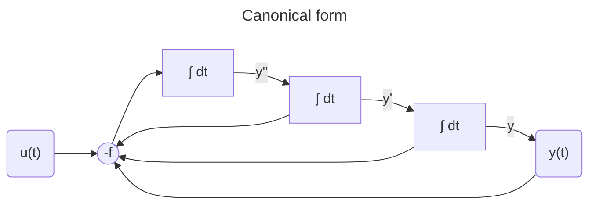
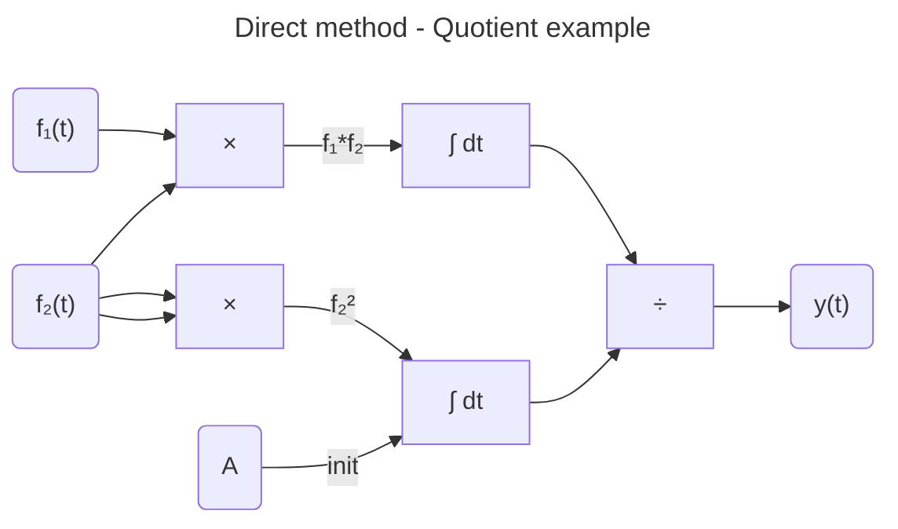
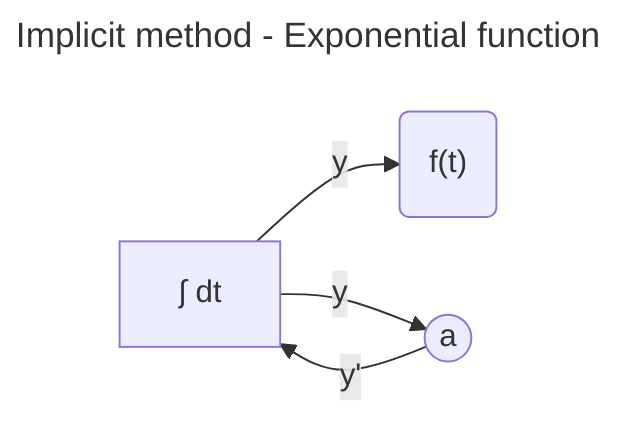
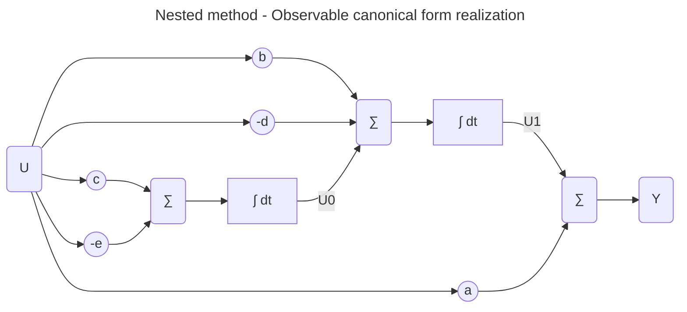
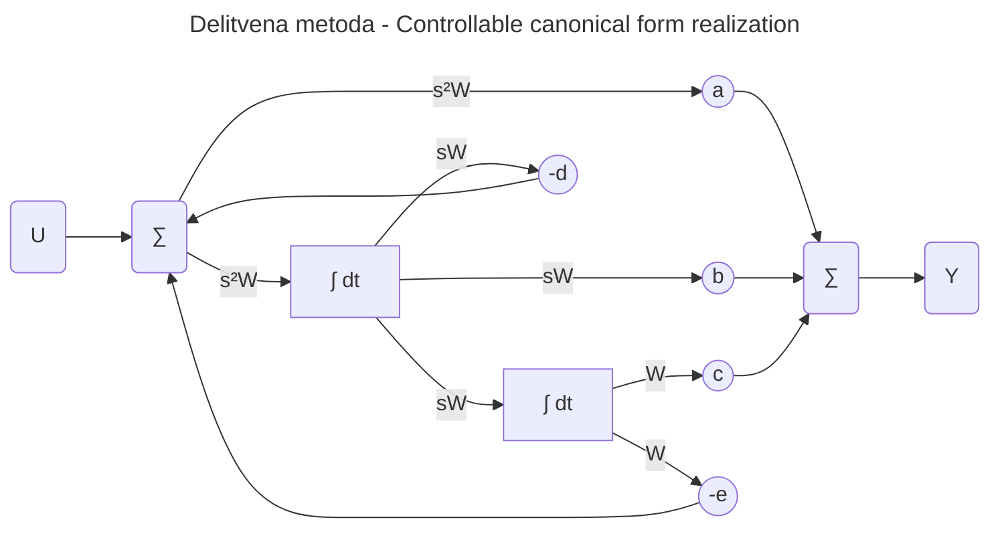
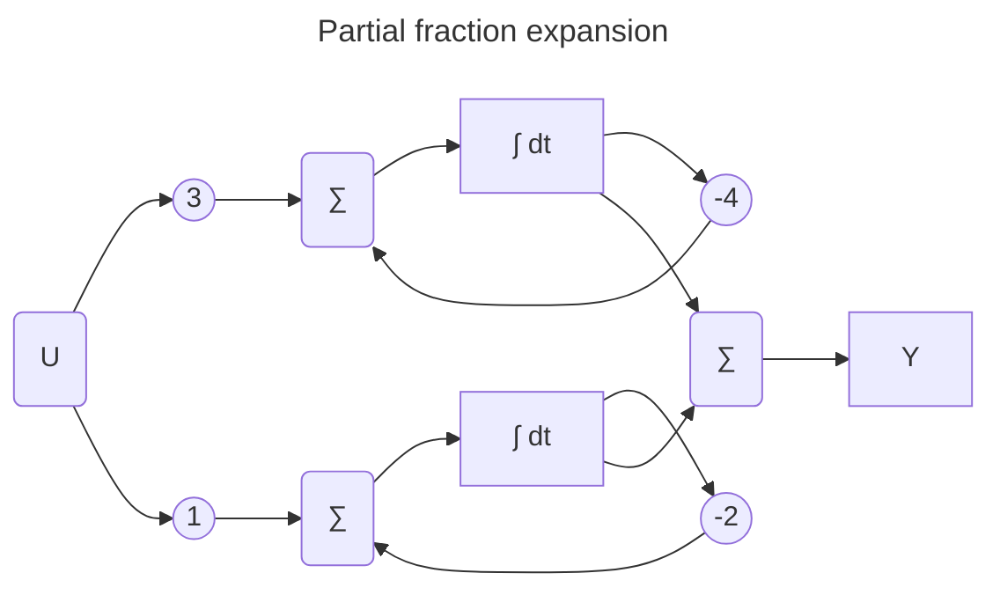
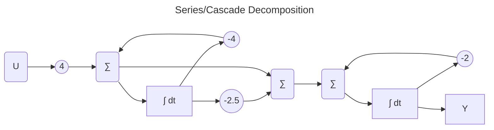

# Basic simulation methods

### Some basic nonmenclature

State space

$$\dot{x} = Ax + Bu$$
$$y = Cx + Du$$

You can use `ss(A,B,C,D)` function.

Transfer function in polynomial form: $$G(s) = \frac{B_1s^2 + B_2 S + B_3}{A_1s^2 + A_2 S + A_3}$$

This one is also liked by MATLAB `tf(B,A)` function.

Transfer function in factorized form: $$G(s) = k\frac{(s - z_1)(s - z_2)}{(s - p_1)(s - p_2)}$$

And this one is liked by `zpk(z,p,k)` function.

## Indirect method

Is useful when we can express the highest order derivative and when the input doesn't have any derivatives.

$$y^{(n)} = -f(y^{(n-1)}, y^{(n-2)}, \ldots, y', y, u; t)$$

1. express the highest order derivative in terms of the input and the state variables (derivatives). In other words, move everything except the highest order derivative to the right side of the equation
2. create a cascade of integrators to integrate the highest order derivative to the state variables (and output)
3. generate negative function using negative summation
4. find out the initial conditions for all integrators

If input signal has derivatives, it's better to simulate the system using transfer functions.

## Direct method

Direct method is usually applied to systems where the equations are algebraic. Here's an example:

$$y(t) = \frac{\displaystyle\int f_1(t) \cdot f_2(t) \, dt}{\displaystyle\int f_2^2(t) \, dt + A}$$

## Implicit method (for generating signals)

Implicit method is used when we want to generate a signal (analytical function). We try to find a differential equation whose solution is the signal we want to generate.

We take the analytical function and differentiate once or more times. At each step we try to express as many variables as possible in terms of the previous variables or their derivatives. The process is finished once we have only the function and its derivatives. The simplest example is the exponential function:

1. function $$y = e^{-\alpha t}$$
2. derive $$y' = -\alpha e^{-\alpha t}$$
3. combine $$y' = -\alpha y$$
4. get initial condition: $$y(0) = 1$$

## Simulation of transfer functions

### Nested method

Let's illustrate the method using an example.

1. $$G(s) = \frac{as^2 + bs + c}{s^2 + ds + e}$$
2. $$(s^2 + ds + e)Y = (as^2 + bs + c)U$$
3. All to the left side: $$s^2(Y - aU)  + s(dY  - bU) + (eY - cU) = 0 $$
4. Only the highest order derivative of input to the left side: $$s^2Y = s^2aU - s(dY + bU) - (eY + cU)$$
5. Move s variable to the right side: $$Y = aU - \frac{dY + bU}{s} - \frac{eY +cU}{s^2}$$
6. Rearrange to nested form: $$Y = aU + \frac{1}{s} \left\{ (bU - dY) + \frac{1}{s}(cU - eY) \right\}$$
7. Add accessory variable $U_0$: $$U_0 = \frac{1}{s} (cU-eY) $$
8. Add accessory variable $U_1$: $$U_1 = \frac{1}{s} (bU - dY + U_0)$$
9. And we get: $$Y = aU + U_1$$

The final result is basicly a practical implementation of observable canonical form. where each $U_n$ represents one state variable.

### "Delitvena metoda" (canonical form realization)

A direct form can be obtained by considering the transfer function H(s) as a cascade of two transfer functions (one for the numerator and one for the denominator).

From this (note that in denominator s^2 has no coefficients!):

$$
H(s) = \frac{as^2 + bs + c}{s^2 + ds + e}
$$

To this:

$$
\begin{array}{ccccccccc}
U(s) & \longrightarrow & \boxed{\frac{W(s)}{U(s)} = \frac{1}{s^2 + ds + e}} & \longrightarrow & W(s) & \longrightarrow & \boxed{\frac{Y(s)}{W(s)} = as^2 + bs + c} & \longrightarrow & Y(s)
\end{array}
$$

where W(s) is a transfer function realization of numerator and Y(s) is a transfer function realization of denominator.

We rearrange W(s) to

$$
s^2 W = U - d s W - e W
$$

And we rearrange Y(s) to

$$
Y = a s^2 W + b s W + c W
$$

The final result is controllable canonical form, where controllable means that the system can be controlled. See [Ogata, 2002, pp. 794]

### Partial fraction expansion (Vzporedna razčlenitev)

We decompose the transfer function into a sum of multiple transfer functions. Here's an example:

$$ G(s) = \frac{4s+10}{s^2 + 6s + 8} $$

1. Find the poles of the transfer function.
2. Decompose the transfer function into a sum of partial fractions: the denominators of the partial fractions are determined by real poles, and in the case of conjugate complex poles, by corresponding quadratic expressions.
3. If the degree of the numerator equals the degree of the denominator, divide the numerator polynomial by the denominator polynomial. This gives us a constant term in the parallel decomposition as well.
4. Draw the simulation scheme of each term. Connect all the inputs of the terms together, and sum the outputs of all terms at a summator.

$$ G(s) = \frac{3}{s + 4} + \frac{1}{s + 2} $$

### Series/Cascade Decomposition (Zaporedna razčlenitev)

This method decomposes a transfer function into a product of simpler transfer functions connected in series (cascade). Let's use the same example as before:

$$ G(s) = \frac{4s+10}{s^2 + 6s + 8} $$

1. Find poles and zeros of the transfer function → factorized form
2. Preserve quadratic expressions for conjugate complex roots
3. Generate a product of multiple transfer functions from the main transfer function; each transfer function contains elementary building blocks such as:
   - Gain (constant)
   - Single pole: `1/(s + a)`
   - Zero-pole pair: `(s + z)/(s + p)`
   - Quadratic expression in denominator
   - Ratio of quadratic expressions
4. Connect these basic building blocks sequentially in the simulation scheme

$$ G = 4G_1 \cdot G_2 $$

where

$$ G_1 = \frac{s + 2.5}{s + 4} $$

and

$$ G_2 = \frac{1}{s + 2} $$

## Canonical forms

State space representation is not unique. The selection of state variables and the order in which they are arranged leads to different representations of the same system. Depending of the requirements, we can rearrange the state space representation into canonical forms (depending on what we want to achieve).:

- controllable canonical form (see above "Nested method")
  - has coefficients of the transfer function in the last row of matrix A
- observable canonical form (see above "delitvena metoda")
  - has coefficients of the transfer function in the last column of matrix A
- diagonal canonical form
  - has eignevalues (poles) on the diagonal of matrix A

The state space representation (matrices A, B, C, D) can be transformed to transfer function with:

$$ G(s) = C(sI - A)^{-1}B + D $$

## Simluation of system with dead time

Laplace tells us that the transfer function with dead time can be expressed as: $e^{-\tau s}$.

Typical simulation implementation is to delay the input signal by dead time and use zero order hold (ZOH) to hold the input signal constant during each sampling period.

Sometimes useful is Pade approximation, first order beeing:

$$ e^{-\tau s} \approx \frac{2 - \tau s}{2 + \tau s} $$

## Digital simulation

All digital simulation tools are based on state space representation, which basicly transfers higher order differential equations into a system of first order differential equations.

$$\dot{\mathbf{x}}(t) = \mathbf{f}(t, \mathbf{x}(t))$$

We've see this before as indirect method, we just use vectors for state variables and output.

Because digital computers like to have all the numbers known before they calculate the result, we must break all the feedback loops (typically at the output of delay block). Instead of doing simultanous calculations, we feed the function with results (=state variables) from the previous step. Initial conditions are nice to have :-), too.

The equations must be ordered in such a way that we always have all the numbers required to calculate the next step. If this is not possible we have a condition called **algebraic loop**.

# References

- Župančič, 2017
- https://cim.mcgill.ca/~boulet/304-501A/L23.pdf
