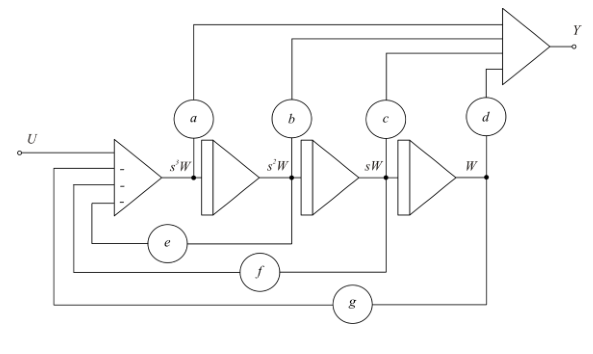

# Simulation of dynamic systems

**Simulation** refers to the imitation or replication of a real-world process or system. It can be used in various fields, such as computer science, psychology, and philosophy, to model reality or predict outcomes.

**Simulacra**, on the other hand, is an image or representation that has no true original. It’s often associated with Jean Baudrillard’s theory of hyperreality, where signs and symbols replace reality itself.

Uses of simulation:

- to improve knowledge and understanding of some mechanisms of the studied system,
- to predict behavior in different situations,
- to estimate process parameters that are not directly measurable,
- to analyze sensitivity of real system parameters,
- to enable experiments that would be expensive, risky or problematic in the real world, which is also important for simulators used for operator training,
- for training operators, pilots, surgeons, etc. using simulators,
- for designing control systems,
- for discovering and understanding faults,
- for safe startup and shutdown of processes,
- for operator training and decision-making assistance,
- for control system applications:
  - for system optimization,
  - for fault detection,
  - for developing control methods (e.g., Ziegler-Nichols methods for PID controller tuning),
  - for developing and evaluating control solutions

## Monte Carlo simulation

Benefits:

- can be used on very complex problems
- additional dimension or nonlinearity can be added easily
- it's possible to estimate uncertainty of the results

Drawbacks:

- has statistical uncertainty
- uncertainty is not known in advance (e.g. how many samples to draw)
- convergence is not guaranteed
- requires adaptation of the algorithm to the problem

# Basic simulation methods

- indirect method (chain of integrators with feedback - most common in digital simulation)
- direct method (algebraic equations)
- implicit method (for generating signals)
- transfer functions
  - nested method (input applied to each one in a chain of integrators with their own feedback. We get observable canonical form) - "Delitvena metoda" (input applied only to the first integrator, which has its own feedback, where output is constructed from all states. We get controllable canonical form)
  - partial fraction expansion (decomposes transfer function into a sum of inverse Laplace-transformable transfer functions)
  - series/cascade decomposition (decomposes transfer function into a product of transfer functions)
- simulation of dead time (using zero order hold and delay block.. easy for simulation, but "not so easy" for reasoning about the system)

### Some basic nomenclature

State space

$$\dot{x} = Ax + Bu$$
$$y = Cx + Du$$

You can use `ss(A,B,C,D)` function.

Transfer function in polynomial form: $$G(s) = \frac{B_1s^2 + B_2 S + B_3}{A_1s^2 + A_2 S + A_3}$$

This one is also liked by MATLAB `tf(B,A)` function.

Transfer function in factorized form: $$G(s) = k\frac{(s - z_1)(s - z_2)}{(s - p_1)(s - p_2)}$$

And this one is liked by `zpk(z,p,k)` function.

## Indirect method

It is useful when we can express the highest order derivative and when the input doesn't have any derivatives.

$$y^{(n)} = -f(y^{(n-1)}, y^{(n-2)}, \ldots, y', y, u; t)$$

1. express the highest order derivative in terms of the input and the state variables (derivatives). In other words, move everything except the highest order derivative to the right side of the equation
2. create a cascade of integrators to integrate the highest order derivative to the state variables (and output)
3. generate negative function using negative summation
4. find out the initial conditions for all integrators


If input signal has derivatives, it's better to simulate the system using transfer functions.

## Direct method

Direct method is usually applied to systems where the equations are algebraic. Here's an example:

$$y(t) = \frac{\displaystyle\int f_1(t) \cdot f_2(t) \, dt}{\displaystyle\int f_2^2(t) \, dt + A}$$


## Implicit method (for generating signals)

Implicit method is used when we want to generate a signal (analytical function). We try to find a differential equation whose solution is the signal we want to generate.

We take the analytical function and differentiate once or more times. At each step we try to express as many variables as possible in terms of the previous variables or their derivatives. The process is finished once we have only the function and its derivatives. The simplest example is the exponential function:

1. function $$y = e^{-\alpha t}$$
2. derive $$y' = -\alpha e^{-\alpha t}$$
3. combine $$y' = -\alpha y$$
4. get initial condition: $$y(0) = 1$$


## Simulation of transfer functions

### Nested method

Let's illustrate the method using an example.

1. $$G(s) = \frac{as^2 + bs + c}{s^2 + ds + e}$$
2. $$(s^2 + ds + e)Y = (as^2 + bs + c)U$$
3. All to the left side: $$s^2(Y - aU)  + s(dY  - bU) + (eY - cU) = 0 $$
4. Only the highest order derivative of input to the left side: $$s^2Y = s^2aU - s(dY + bU) - (eY + cU)$$
5. Move s variable to the right side: $$Y = aU - \frac{dY + bU}{s} - \frac{eY +cU}{s^2}$$
6. Rearrange to nested form: $$Y = aU + \frac{1}{s} \left( (bU - dY) + \frac{1}{s}(cU - eY) \right)$$
7. Add accessory variable $U_0$: $$U_0 = \frac{1}{s} (cU-eY) $$
8. Add accessory variable $U_1$: $$U_1 = \frac{1}{s} (bU - dY + U_0)$$
9. And we get: $$Y = aU + U_1$$


The final result is basically a practical implementation of observable canonical form, where each $U_n$ represents one state variable.

### "Delitvena metoda" (canonical form realization)

A direct form can be obtained by considering the transfer function H(s) as a cascade of two transfer functions (one for the numerator and one for the denominator).

From this (note that in denominator $$s^2$$ has no coefficients!):

$$
H(s) = \frac{as^2 + bs + c}{s^2 + ds + e}
$$

To this:

$$
\begin{array}{ccccccccc}
U(s) & \longrightarrow & \boxed{\frac{W(s)}{U(s)} = \frac{1}{s^2 + ds + e}} & \longrightarrow & W(s) & \longrightarrow & \boxed{\frac{Y(s)}{W(s)} = as^2 + bs + c} & \longrightarrow & Y(s)
\end{array}
$$

where W(s) is a transfer function realization of numerator and Y(s) is a transfer function realization of denominator.

We rearrange W(s) to

$$
s^2 W = U - d s W - e W
$$

And we rearrange Y(s) to

$$
Y = a s^2 W + b s W + c W
$$



The final result is controllable canonical form, where controllable means that the system can be controlled. See [Ogata, 2002, pp. 794]

### Partial fraction expansion (Vzporedna razčlenitev)

We decompose the transfer function into a sum of multiple transfer functions. Here's an example:

$$ G(s) = \frac{4s+10}{s^2 + 6s + 8} $$

1. Find the poles of the transfer function.
2. Decompose the transfer function into a sum of partial fractions: the denominators of the partial fractions are determined by real poles, and in the case of conjugate complex poles, by corresponding quadratic expressions.
3. If the degree of the numerator equals the degree of the denominator, divide the numerator polynomial by the denominator polynomial. This gives us a constant term in the parallel decomposition as well.
4. Draw the simulation scheme of each term. Connect all the inputs of the terms together, and sum the outputs of all terms at a summator.

$$ G(s) = \frac{3}{s + 4} + \frac{1}{s + 2} $$


### Series/Cascade Decomposition (Zaporedna razčlenitev)

This method decomposes a transfer function into a product of simpler transfer functions connected in series (cascade). Let's use the same example as before:

$$ G(s) = \frac{4s+10}{s^2 + 6s + 8} $$

1. Find poles and zeros of the transfer function → factorized form
2. Preserve quadratic expressions for conjugate complex roots
3. Generate a product of multiple transfer functions from the main transfer function; each transfer function contains elementary building blocks such as:
   - Gain (constant)
   - Single pole: `1/(s + a)`
   - Zero-pole pair: `(s + z)/(s + p)`
   - Quadratic expression in denominator
   - Ratio of quadratic expressions
4. Connect these basic building blocks sequentially in the simulation scheme

$$ G = 4G_1 \cdot G_2 $$

where

$$ G_1 = \frac{s + 2.5}{s + 4} $$

and

$$ G_2 = \frac{1}{s + 2} $$


```{=latex}
\begin{figure}[h]
\centering
\begin{tikzpicture}[
    node distance=1.5cm,
    block/.style={rectangle, draw, minimum width=1cm, minimum height=0.8cm},
    sum/.style={circle, draw, minimum size=0.8cm},
    gain/.style={circle, draw, minimum size=0.8cm},
    integrator/.style={rectangle, draw, minimum width=1.2cm, minimum height=0.8cm}
]

% Nodes
\node[gain] (U) {U};
\node[gain, right of=U, node distance=2cm] (A) {4};
\node[sum, right of=A, node distance=2cm] (SUM1) {$\sum$};
\node[integrator, right of=SUM1, node distance=2cm] (I1) {$\int dt$};
\node[sum, right of=I1, node distance=2cm] (SUM2) {$\sum$};
\node[sum, right of=SUM2, node distance=2cm] (SUM3) {$\sum$};
\node[integrator, right of=SUM3, node distance=2cm] (I3) {$\int dt$};
\node[gain, right of=I3, node distance=2cm] (Y) {Y};

% Feedback gains
\node[gain, below of=I1, node distance=1.5cm] (B) {-4};
\node[gain, below of=SUM2, node distance=1.5cm] (C) {-2.5};
\node[gain, below of=I3, node distance=1.5cm] (D) {-2};

% Connections
\draw[->] (U) -- (A);
\draw[->] (A) -- (SUM1);
\draw[->] (SUM1) -- (I1);
\draw[->] (I1) -- (SUM2);
\draw[->] (SUM2) -- (SUM3);
\draw[->] (SUM3) -- (I3);
\draw[->] (I3) -- (Y);

% Feedback connections
\draw[->] (I1) |- (B);
\draw[->] (B) -| (SUM1);
\draw[->] (I1) |- (C);
\draw[->] (C) -- (SUM2);
\draw[->] (I3) |- (D);
\draw[->] (D) -| (SUM3);

\end{tikzpicture}
\caption{Series/Cascade Decomposition (incomplete conversion from mermaid above! TODO)}
\end{figure}
```

## Canonical forms

State space representation is not unique. The selection of state variables and the order in which they are arranged leads to different representations of the same system. Depending on the requirements, we can rearrange the state space representation into canonical forms (depending on what we want to achieve):

- controllable canonical form (see above "nested method")
  - has coefficients of the transfer function in the last row of matrix A
- observable canonical form (see above "delitvena metoda")
  - has coefficients of the transfer function in the last column of matrix A
- diagonal canonical form
  - has eigenvalues (poles) on the diagonal of matrix A

The state space representation (matrices A, B, C, D) can be transformed to transfer function with:

$$ G(s) = C(sI - A)^{-1}B + D $$

## Simulation of system with dead time

Laplace tells us that the transfer function with dead time is

$$e^{-\tau s}$$

Typical simulation implementation is to delay the input signal by dead time and use zero order hold (ZOH) to hold the input signal constant during each sampling period.

Sometimes useful is Pade approximation, first order being:

$$ e^{-\tau s} \approx \frac{2 - \tau s}{2 + \tau s} $$

## Digital simulation

All digital simulation tools are based on state space representation, which basically transfers higher order differential equations into a system of first order differential equations.

$$\dot{\boldsymbol{x}}(t) = \boldsymbol{f}(t, \boldsymbol{x}(t))$$

We've seen this before as indirect method, we just use vectors for state variables and output.

Digital computers also absolutely require **discretization**.


Because digital computers like to have all the numbers known before they calculate the result, we must break all the feedback loops (typically at the output of delay block). Instead of doing simultaneous calculations, we feed the function with results (=state variables) from the previous step. Initial conditions are nice to have :-), too.

The equations must be ordered in such a way that we always have all the numbers required to calculate the next step. If this is not possible we have a condition called **algebraic loop**.

# Dynamic systems simulation tools

## Linearization

So we want to linearize a nonlinear system around an operating point. Basicly we want to know A,B,C,D of state space:

$$\dot{x} = Ax + Bu$$
$$y = Cx + Du$$

Analytically we can do this by expanding the nonlinear function into a Taylor series and keeping only the first order terms.

We can also use perturbation method. The functions in the schematic below are nonlinear. We bring the system to the operating point and then perturb the states $$\boldsymbol{x_0}$$. We observe the effect on $$\dot{\boldsymbol{x}}_0$$ and construct matrices **A** and **C**. The we perturb the input $$\boldsymbol{u_0}$$ and observe the effect on $$\dot{\boldsymbol{x}}_0$$ and construct matrices **B** and **D**.


In practice we use MATLAB's `linmod` which uses magic to do the same thing.

## Performance Indices

- integral square error (ISE)
- integral time square error (ITSE)
- integral absolute error (IAE)
- integral time absolute error (ITAE)

# Numerical methods

- single-step methods (implicit and explicit),
- multi-step methods (implicit and explicit),
- extrapolation methods and
- methods for simulation of stiff systems.

## Selection of integration method

Inputs:

- accuracy requirements,
  - higher required accuracy => higher order method
- frequency of discontinuities
- multistep methods need to recalculate initial conditions after each discontinuity
- stiffness,
- oscillatory nature

## Errors

- Usually the global error is larger than the local error.
- In certain cases it can become infinite.
- Global error cannot be estimated during simulation.
- Limited local error also does not guarantee limited global error.
- Local error estimation represents the only possibility for accuracy control during simulation (we calculate the result for h and 2h and compare the results).

Total error is the sum of:

- method error (proportional: $$\mathbf{e}_{k+1} \propto h^{m+1}$$)
- roundoff error

## Stability

Similar to general dynamic systems, the system is stable if all eigenvalues of Jacobi matrix are negative real numbers.

For example Euler is stable in circle around -1 in $\lambda h$ plane (where lambda is eigenvalue of the function and h is step size).

RK methods are stable in larger area (typically higher order methods are stable in larger area).

## Methods predictor-corrector

Predictor-corrector methods are used to improve the accuracy of numerical integration by predicting the next value and then correcting it based on the actual value.

# References

- Župančič, 2017
- https://cim.mcgill.ca/~boulet/304-501A/L23.pdf
  $$
