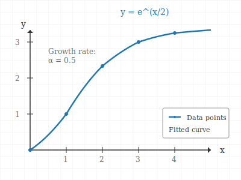

# install

- [Pandoc](https://pandoc.org/)
- [MiKTeX](https://miktex.org/)
- [pandoc-crossref](https://github.com/lierdakil/pandoc-crossref/releases)
- [vscode-pandoc](https://marketplace.visualstudio.com/items?itemName=DougFinke.vscode-pandoc)

# Introduction

Compile this using book [@shiltsev2008tevatron]:

`pandoc pandoc.md -o pandoc.pdf --pdf-engine=xelatex -V geometry:margin=1in`

`pandoc pandoc.md -o pandoc.pdf --pdf-engine=xelatex -V geometry:margin=1in --number-sections --toc --citeproc --filter pandoc-crossref`

## defininiton lists

lore ipsum dolor sit amet, consectetur adipiscing elit. Sed do eiusmod tempor incididunt ut labore et dolore magna aliqua. Ut enim ad minim veniam, quis nostrud exercitation ullamco laboris nisi ut aliquip ex ea commodo consequat. Duis aute irure dolor in reprehenderit in voluptate velit esse cillum dolore eu fugiat nulla pariatur
excepteur sint occaecat cupidatat non proident, sunt in culpa qui officia deserunt mollit

Term 1

: lore ipsum dolor sit amet, consectetur adipiscing elit. Sed do eiusmod tempor incididunt ut labore et dolore magna aliqua. Ut enim ad minim veniam, quis nostrud exercitation ullamco laboris nisi ut aliquip ex ea commodo consequat.

Term 2

: Duis aute irure dolor in reprehenderit in voluptate velit esse cillum dolore eu fugiat nulla pariatur
excepteur sint occaecat cupidatat non proident, sunt in culpa qui officia deserunt mollit

simpler alternativ:

```yaml
header-includes:
  - \renewenvironment{quote}{\begin{center}\itshape}{\end{center}}
```

H^3^ is cool.

```{.haskell}
fibs = 1 : 1 : zipWith (+) (tail fibs) fibs
```

An example showcasing R Markdown capabilities.

$$\int{-\infty}^{\infty} e^{-x^2} dx = \sqrt{\pi}$$

### Data Summary

## Markdown Features Showcase

### Lists

- Unordered item 1
- Unordered item 2
  - Nested item
    - Deeper nested item

### Task List

- [x] Write example
- [ ] Add more features

### Links

[GitHub Copilot](https://github.com/features/copilot)

### Blockquote

> This is a blockquote.
>
> > Nested blockquote.

### Inline Code

Use `console.log('Hello, world!')` for output.

### Code Block

```python
def hello():
    print("Hello, world!")
```

### Math (LaTeX)

Inline: $E = mc^2$

Block:

$$
\frac{a}{b} = c
$$

### Table

Table: I'm a random table.

| Syntax | Description |
| ------ | ----------- |
| Header | Title       |
| Cell   | Text        |

### Horizontal Rule

---

### Numbered and Referenced Images

Here is an example an image:



### Numbered and Referenced Tables

Here is an example of a numbered and referenced table:

Table: This is a caption for the table below {#tbl:sampletable}

| Col1 | Col2 |
| ---- | ---- |
| 1    | 2    |
| 3    | 4    |

---

### Footnote

Here is a footnote reference.[^1] And now we're referencing the table above @tbl:sampletable.

### Citations

This is an example citation to a book [@knuth1984].

Multiple citations: [@knuth1984; @doe2020].

## footnotes

[^1]: This is the footnote content.

### Escaping

\*This text is not italic\*

### HTML

<details>
<summary>Click to expand</summary>
<p>Some hidden details!</p>
</details>

---

```javascript
const bla = {};
bla.foo = function () {
  console.log("Hello, world!");
};
bla.foo();
```

### TikZ Diagrams

Here's an example of a two-pulley system drawn with TikZ:

```{=latex}
\begin{figure}[htbp]
\centering
\begin{tikzpicture}[scale=1.2]
    % Define coordinates
    \coordinate (A) at (0, 4);
    \coordinate (B) at (4, 4);
    \coordinate (C) at (0, 2);
    \coordinate (D) at (4, 2);

    % Draw ceiling supports
    \draw[very thick] (-0.5, 4.5) -- (4.5, 4.5);

    % Draw pulleys
    \draw[thick] (A) circle (0.3);
    \draw[thick] (B) circle (0.3);
    \fill[gray!20] (A) circle (0.3);
    \fill[gray!20] (B) circle (0.3);

    % Draw pulley centers
    \fill[black] (A) circle (0.05);
    \fill[black] (B) circle (0.05);

    % Draw support lines from ceiling
    \draw[thick] (A) -- (0, 4.5);
    \draw[thick] (B) -- (4, 4.5);

    % Draw rope
    \draw[thick, red] (-0.5, 1) -- (-0.3, 4) arc (180:0:0.3) -- (3.7, 4) arc (180:0:0.3) -- (4.5, 1);

    % Draw masses
    \draw[thick, fill=blue!20] (-0.7, 0.5) rectangle (-0.3, 1.5);
    \draw[thick, fill=green!20] (4.3, 0.5) rectangle (4.7, 1.5);

    % Labels
    \node at (-0.5, 0) {$m_1$};
    \node at (4.5, 0) {$m_2$};
    \node at (0, 3.5) {$P_1$};
    \node at (4, 3.5) {$P_2$};

    % Force arrows
    \draw[thick, ->] (-0.5, 1.5) -- (-0.5, 2.2) node[left] {$T$};
    \draw[thick, ->] (4.5, 1.5) -- (4.5, 2.2) node[right] {$T$};
    \draw[thick, ->] (-0.5, 0.5) -- (-0.5, -0.2) node[left] {$m_1g$};
    \draw[thick, ->] (4.5, 0.5) -- (4.5, -0.2) node[right] {$m_2g$};

    % Dimensions
    \draw[<->] (-1, 4) -- (-1, 2) node[midway, left] {$h_1$};
    \draw[<->] (5, 4) -- (5, 2) node[midway, right] {$h_2$};
\end{tikzpicture}
\caption{Two-pulley system with masses $m_1$ and $m_2$ connected by an inextensible rope}
\label{fig:pulley-system}
\end{figure}
```

The pulley system shown in Figure \ref{fig:pulley-system} demonstrates the mechanical advantage principle.

## Introduction

In this document, we will generate a scatterplot
of the `mpg` and `wt` variables in the `mtcars`
dataset using R.

book [@shiltsev2008tevatron]

## References
